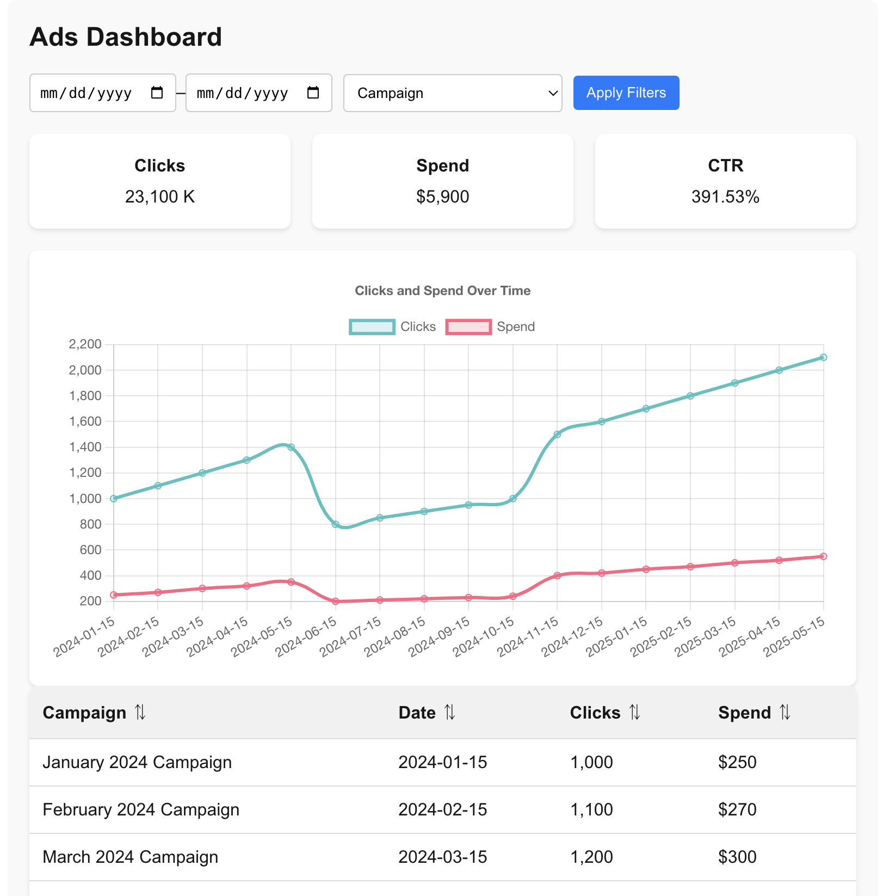

# AdMetrics Dashboard (UI)

A responsive, single-page analytics dashboard that displays ad campaign performance using mock data. Built with **React** and **TypeScript**, this UI showcases component design, layout structuring, and data visualization for a marketing or ad-tech context.

## Features
- Dashboard layout with:
  - Date range selector
  - Campaign dropdown filter
  - KPI tiles: Clicks, Spend, CTR
  - Campaign performance table with sortable rows
  - Line chart of Clicks and Spend over time
- Built using **mock JSON data** with no external API dependencies

## Preview


## Tech Stack
- React
- TypeScript
- Chart.js

## Getting Started

### Prerequisites

- Node.js (v16+)
- npm or yarn

### Installation

```bash
git clone https://github.com/edhollmon/ad-campaign-dashboard-clone-ui.git
cd admetrics-dashboard
npm install
```

### Run the Development Server
```bash
npm start
```
The app will be available at http://localhost:3000


